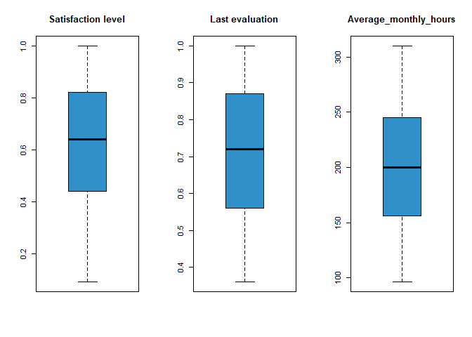

**Why might our employees leave?**
================

**Heads up:** *The names, content, and the narrative around the data
used in this work are fictional; a combined product of my imagination
and inspiration from the case study packet provided for Track 2 of the
capstone project course- course 8- of the [Google Data Analytics
Professional Certificate on
Coursera](https://www.coursera.org/professional-certificates/google-data-analytics?utm_source=gg&utm_medium=sem&utm_campaign=15-GoogleDataAnalytics-ROW&utm_content=B2C&campaignid=12566515400&adgroupid=117869292925&device=c&keyword=best%20courses%20for%20data%20analytics&matchtype=b&network=g&devicemodel=&adpostion=&creativeid=507290840618&hide_mobile_promo&gclid=CjwKCAjwt7SWBhAnEiwAx8ZLarCAB15nWLR97OdBdUrdZBVrolvnYzsLaXnXZnfbGHMTWsNnWC-SDxoCdJYQAvD_BwE).
Hence, the insights generated are not necessarily representative of
reality.*

*The data used is [a public employee profile dataset from
Kaggle](https://www.kaggle.com/datasets/jacksonchou/hr-data-for-analytics?select=HR_comma_sep.csv)
made available under the [CC0: Public
Domain](https://creativecommons.org/publicdomain/zero/1.0/) license.*

*My choice of this dataset and the project, entirely, is stirred by my
love for the **Human Resources** profession and how **People Analytics**
should be embraced to promote data-driven decision making in HR. I hope
you enjoy the ride through this work as much as I did creating it.*

## The Scenario

In this project, I worked as a junior People Analyst for a business
intelligence consultant, **Jotgel Analytics**. My organization
specializes in helping businesses make informed decisions across
different business functions using data and Business intelligence
technologies. Although I only joined the team 6 months ago, the People
Analytics unit Manager, Clara Michael, who is also my boss, believes I
am ready to take up bigger challenges and had asked me to lead a project
for a new client, **Qeug**.

***About Qeug***

Qeug provides training and counseling services to young immigrants
looking to settle in a new country anywhere, land a job early enough,
and continue to get personal and career guidance for, at least, a year
into their first job.

Qeug is young, only in its first month of operation. However, the CEO
believes he is building a company that has come to stay. He had shared
this vision with the HR Director, Tracy Victor upon her coming on board,
with the later counseling that, as Qeug renders a
human-to-human-interaction-based service, it needs its best hands on the
job for as long as possible, especially as it wades through its infancy
stage. For example, a customer might have gotten used to an employee in
a counseling role and they may not be pleased starting all over with a
new employee. Qeug cannot afford to lose any of its customers at this
early stage too.

So, according to the HR director, Qeug needs to be intentional about
creating a good place to work for its employees so they can stick around
long enough to continue to help its clients navigate their way to
success and comfort in a new country. It believes that, to get on a good
path towards achieving this, the company can begin with getting a
generic view of likely reasons why employees may leave, as a guide in
sketching and implementing evolve-able preventive policies early on.
Alongside this, they can use the insights generated to spot factors
similar or peculiar to Qeug’s situation as they accumulate more internal
data towards their first end-of-year analysis, rather than wait for
contingent situations to occur.

Tracy had these questions:

-   What is the turnover status from the dataset being examined?

-   What are the likely reasons why an employee may leave?

-   What recommendations can guide Qeug in its quest to retain its
    employees?

## Executing the project

Having Learnt about the Data Analytics process in the [Google Data
Analytics Certificate
Program](https://www.coursera.org/professional-certificates/google-data-analytics?utm_source=gg&utm_medium=sem&utm_campaign=15-GoogleDataAnalytics-ROW&utm_content=B2C&campaignid=12566515400&adgroupid=117869292925&device=c&keyword=best%20courses%20for%20data%20analytics&matchtype=b&network=g&devicemodel=&adpostion=&creativeid=507290840618&hide_mobile_promo&gclid=CjwKCAjwt7SWBhAnEiwAx8ZLarCAB15nWLR97OdBdUrdZBVrolvnYzsLaXnXZnfbGHMTWsNnWC-SDxoCdJYQAvD_BwE),
I have taken a liking to applying it in my projects as it helps for
**structured thinking**. While there are other variations of the
process, like the EMC data analytics life-cycle, the SAS data analytics
life-cycle, the big data analytics…, etc., I used the Google Data
analytics process as my guide in this project. It includes the
**Ask**-**Prepare**-**Process**-**Analyze**-**Share**-**Act** phases.

### **Ask:**

In this phase, I framed my statement of the business task and Identified
my Key stakeholders

**Statement of the Business Task**

To identify likely reasons for employee turnover in order to outline
guiding preventive measures.

**Key Stakeholders**

-   Qeug CEO

-   HR Director, Tracy Victor

### **Prepare:**

In this phase, I accessed the dataset he project. The HR Director has
identified an employee profile dataset dataset from a hypothetical large
company, made publicly available on Kaggle under the [CC0: Public
Domain](https://creativecommons.org/publicdomain/zero/1.0/) license,
with the current sharer hinting that the original provider had deleted
their own submission. The data holds employee profile information.

<https://www.kaggle.com/datasets/jacksonchou/hr-data-for-analytics?select=HR_comma_sep.csv>

which she would like me to use. While the data may not entirely
represent Qeug’s business context, she believes it can provide the
generic view they need on employee turnover.

I needed to get a closer look at my data so, I proceeded to set up my
environment. As you may have noticed, I used R for this project. You can
also use Python, spreadsheets, a combination of an SQL server and one of
the Bi tools like Tableau and PowerBi, among other options.

## Setting up my environment

I installed required packages; the `tidyverse`, and `skimr`. I used the
`skimr` package because I wanted to explore the data set in depth before
answering the questions.

And, I loaded the packages.

``` r
#install.packages("tidyverse")
#install.packages("skimr")
#install.packages("ggplot2")
```

``` r
library(tidyverse)
```

    ## ── Attaching packages ─────────────────────────────────────── tidyverse 1.3.2 ──
    ## ✔ ggplot2 3.3.6      ✔ purrr   0.3.4 
    ## ✔ tibble  3.1.8      ✔ dplyr   1.0.10
    ## ✔ tidyr   1.2.0      ✔ stringr 1.4.1 
    ## ✔ readr   2.1.2      ✔ forcats 0.5.2 
    ## ── Conflicts ────────────────────────────────────────── tidyverse_conflicts() ──
    ## ✖ dplyr::filter() masks stats::filter()
    ## ✖ dplyr::lag()    masks stats::lag()

``` r
library(skimr)
library(ggplot2)
```

I then moved on to load the data set.

``` r
employee_profile_data <- read_csv("~/R_project_files/Track2- GooogleDAcapstoneproject/First_HR_Analytics_Project/employee_profile_data.csv")
```

    ## Rows: 14999 Columns: 10
    ## ── Column specification ────────────────────────────────────────────────────────
    ## Delimiter: ","
    ## chr (2): sales, salary
    ## dbl (8): satisfaction_level, last_evaluation, number_project, average_montly...
    ## 
    ## ℹ Use `spec()` to retrieve the full column specification for this data.
    ## ℹ Specify the column types or set `show_col_types = FALSE` to quiet this message.

## Getting to know the data

Next, I used functions like `head()`, `str()`, `glimpse()`,
`colnames()`, and `skim_without_charts()` to get a summarized
description of the data.

With the `head()` function, I get to see the first 6 rows and all
columns of the data set. However, what is more interesting, for me, is
getting a peek into the data types and column names.

``` r
head(employee_profile_data)
```

    ## # A tibble: 6 × 10
    ##   satisfact…¹ last_…² numbe…³ avera…⁴ time_…⁵ Work_…⁶  left promo…⁷ sales salary
    ##         <dbl>   <dbl>   <dbl>   <dbl>   <dbl>   <dbl> <dbl>   <dbl> <chr> <chr> 
    ## 1        0.38    0.53       2     157       3       0     1       0 sales low   
    ## 2        0.8     0.86       5     262       6       0     1       0 sales medium
    ## 3        0.11    0.88       7     272       4       0     1       0 sales medium
    ## 4        0.72    0.87       5     223       5       0     1       0 sales low   
    ## 5        0.37    0.52       2     159       3       0     1       0 sales low   
    ## 6        0.41    0.5        2     153       3       0     1       0 sales low   
    ## # … with abbreviated variable names ¹​satisfaction_level, ²​last_evaluation,
    ## #   ³​number_project, ⁴​average_montly_hours, ⁵​time_spend_company,
    ## #   ⁶​Work_accident, ⁷​promotion_last_5years

The `str()` and `glimpse()` functions help me better understand the
data.

``` r
str(employee_profile_data)
```

    ## spec_tbl_df [14,999 × 10] (S3: spec_tbl_df/tbl_df/tbl/data.frame)
    ##  $ satisfaction_level   : num [1:14999] 0.38 0.8 0.11 0.72 0.37 0.41 0.1 0.92 0.89 0.42 ...
    ##  $ last_evaluation      : num [1:14999] 0.53 0.86 0.88 0.87 0.52 0.5 0.77 0.85 1 0.53 ...
    ##  $ number_project       : num [1:14999] 2 5 7 5 2 2 6 5 5 2 ...
    ##  $ average_montly_hours : num [1:14999] 157 262 272 223 159 153 247 259 224 142 ...
    ##  $ time_spend_company   : num [1:14999] 3 6 4 5 3 3 4 5 5 3 ...
    ##  $ Work_accident        : num [1:14999] 0 0 0 0 0 0 0 0 0 0 ...
    ##  $ left                 : num [1:14999] 1 1 1 1 1 1 1 1 1 1 ...
    ##  $ promotion_last_5years: num [1:14999] 0 0 0 0 0 0 0 0 0 0 ...
    ##  $ sales                : chr [1:14999] "sales" "sales" "sales" "sales" ...
    ##  $ salary               : chr [1:14999] "low" "medium" "medium" "low" ...
    ##  - attr(*, "spec")=
    ##   .. cols(
    ##   ..   satisfaction_level = col_double(),
    ##   ..   last_evaluation = col_double(),
    ##   ..   number_project = col_double(),
    ##   ..   average_montly_hours = col_double(),
    ##   ..   time_spend_company = col_double(),
    ##   ..   Work_accident = col_double(),
    ##   ..   left = col_double(),
    ##   ..   promotion_last_5years = col_double(),
    ##   ..   sales = col_character(),
    ##   ..   salary = col_character()
    ##   .. )
    ##  - attr(*, "problems")=<externalptr>

``` r
glimpse(employee_profile_data)
```

    ## Rows: 14,999
    ## Columns: 10
    ## $ satisfaction_level    <dbl> 0.38, 0.80, 0.11, 0.72, 0.37, 0.41, 0.10, 0.92, …
    ## $ last_evaluation       <dbl> 0.53, 0.86, 0.88, 0.87, 0.52, 0.50, 0.77, 0.85, …
    ## $ number_project        <dbl> 2, 5, 7, 5, 2, 2, 6, 5, 5, 2, 2, 6, 4, 2, 2, 2, …
    ## $ average_montly_hours  <dbl> 157, 262, 272, 223, 159, 153, 247, 259, 224, 142…
    ## $ time_spend_company    <dbl> 3, 6, 4, 5, 3, 3, 4, 5, 5, 3, 3, 4, 5, 3, 3, 3, …
    ## $ Work_accident         <dbl> 0, 0, 0, 0, 0, 0, 0, 0, 0, 0, 0, 0, 0, 0, 0, 0, …
    ## $ left                  <dbl> 1, 1, 1, 1, 1, 1, 1, 1, 1, 1, 1, 1, 1, 1, 1, 1, …
    ## $ promotion_last_5years <dbl> 0, 0, 0, 0, 0, 0, 0, 0, 0, 0, 0, 0, 0, 0, 0, 0, …
    ## $ sales                 <chr> "sales", "sales", "sales", "sales", "sales", "sa…
    ## $ salary                <chr> "low", "medium", "medium", "low", "low", "low", …

The `colnames()` function provides me a list of the names of the columns
in the data set.

``` r
colnames(employee_profile_data)
```

    ##  [1] "satisfaction_level"    "last_evaluation"       "number_project"       
    ##  [4] "average_montly_hours"  "time_spend_company"    "Work_accident"        
    ##  [7] "left"                  "promotion_last_5years" "sales"                
    ## [10] "salary"

From the above, the data set has 14,999 rows and 10 columns. Most of the
columns hold numeric data, with only two containing text data, and in
this case, categorical.

The data provides information like satisfaction level, results obtained
from last evaluation, number of projects an employee was involved in for
the year, how long the employee has been in the organization, if they
have been involved in any accident at work, if they are still with the
organization or have left, etc. Each row is a record representing an
employee.

Some columns, although descriptive, could be better if shorter, e.g, the
`time_spend_company` column. The name, `sales`, is inappropriate for the
information contained in the column it represents. The column shows the
department an employee belongs to rather than sales details.

With 14,999 records, the data set is enough for this analysis. The
essence of the project is to look at historical, non-Qeug data, so the
data is also appropriate for the task. Furthermore, it has been stripped
of all personally Identifiable information (PII) like employee names,
email address, residential address, phone number, etc., and it is cited.

Safe to say our Data ROCCS!

### **Process:**

In this phase, I cleaned and transformed my data in preparation for
analysis, and documented each action in a change log. Access it here.

Recall that, in the prepare phase, some data transformation needs had
already been identified. So, in this phase, I examined the data further
to detect dirty data issues, and fix them.

Because I do not like to assume data cleaning issues as that may lead to
missing out on those I do not remember or have never encountered, I
prefer to use techniques that will search through the data to fish them
out. So, I coined a sequential process to use in combination with the
usual dirty data scenarios most Data Analysts face, like the duplicate
records, missing values, incorrect or misspelled values, outliers, etc.
I call my process the **Detect**-**Expose**-**Fix** Model.

In some cases, all of these three steps can be achieved in one syntax,
query or code. In some,two of the steps gets tackled at a go. When
otherwise, each step is executed in turn. Let’s begin!

**Removing Duplicates**  
I usually like to begin cleaning my dataset by removing duplicates but
the context of the dataset has to be considered. For this dataset, there
are no unique Identifiers for each record. so, there is no evidence that
any of the entries is duplicated. Each entry represents details about
one employee. Based on the fore-stated, I skipped that step.

**Addressing Missing Values**

``` r
employee_profile_data %>%
  is.na %>%
  sum
```

    ## [1] 0

``` r
sum(is.na(employee_profile_data))
```

    ## [1] 0

There are no missing values in this dataset.

**Renaming columns**

The `time_spend_company` column is better if shorter. I renamed it as
`tenure`. The name, “sales”, is incorrect for the information contained
in the column it represents. Instead, the entries in the column show the
`department` each employee works in. I also renamed the
promotion_last_5years and number_project columns. The goal here was to
make each column more representative and descriptive.

``` r
employee_profile_renamed <- 
employee_profile_data %>%
  rename(tenure = time_spend_company, department = sales, promoted_last_5years = promotion_last_5years, num_of_projects = number_project, mean_monthly_hours = average_montly_hours)
```

To confirm this change, I called the `colnames()` function again

``` r
colnames(employee_profile_renamed)
```

    ##  [1] "satisfaction_level"   "last_evaluation"      "num_of_projects"     
    ##  [4] "mean_monthly_hours"   "tenure"               "Work_accident"       
    ##  [7] "left"                 "promoted_last_5years" "department"          
    ## [10] "salary"

Changes were effected!

**Checking for incorrectly entered or Misspelled values**

Following my **Detect-Expose-Fix** model, I want to get distinct values
of entries in columns with categorical data. This will help bring
incorrectly entered or mis-spelled values to the fore. The columns are
the

``` r
unique(employee_profile_renamed)
```

    ## # A tibble: 11,991 × 10
    ##    satisfa…¹ last_…² num_o…³ mean_…⁴ tenure Work_…⁵  left promo…⁶ depar…⁷ salary
    ##        <dbl>   <dbl>   <dbl>   <dbl>  <dbl>   <dbl> <dbl>   <dbl> <chr>   <chr> 
    ##  1      0.38    0.53       2     157      3       0     1       0 sales   low   
    ##  2      0.8     0.86       5     262      6       0     1       0 sales   medium
    ##  3      0.11    0.88       7     272      4       0     1       0 sales   medium
    ##  4      0.72    0.87       5     223      5       0     1       0 sales   low   
    ##  5      0.37    0.52       2     159      3       0     1       0 sales   low   
    ##  6      0.41    0.5        2     153      3       0     1       0 sales   low   
    ##  7      0.1     0.77       6     247      4       0     1       0 sales   low   
    ##  8      0.92    0.85       5     259      5       0     1       0 sales   low   
    ##  9      0.89    1          5     224      5       0     1       0 sales   low   
    ## 10      0.42    0.53       2     142      3       0     1       0 sales   low   
    ## # … with 11,981 more rows, and abbreviated variable names ¹​satisfaction_level,
    ## #   ²​last_evaluation, ³​num_of_projects, ⁴​mean_monthly_hours, ⁵​Work_accident,
    ## #   ⁶​promoted_last_5years, ⁷​department
    ## # ℹ Use `print(n = ...)` to see more rows

**Dealing with Outliers**

create box plot

Some columns show marked deviations, e.g, the `average_monthly_hours`
column. So, there are indications of outliers. But the context of the
dataset needs to be considered here before labeling extreme values as
outliers. Looking at the `num_of_projects` column for example, some
employees may have participated in much more projects than others. Also,
for the `time_spend_company` or `` ` ``average_monthly_hours\` data, it
is not out of place for some employees to have worked for far more years
from the average time spent in the company or that an employee could
work double the time an employee would work on average so, in the
context of the dataset and this analysis. in particular, **outliers may
not mean incorrect data or out-of-range data, especially as there is no
maximum range set.** Hence, the solution to treating these particular
set of outliers is not removing them.

-   Also, from the `skim_without_charts` output, the standard deviation
    results for some columns indicate presence of outliers.

With the `skim_without_charts()` function, I get a more detailed summary
of the data, enriched with summary statistics.

``` r
skim_without_charts(employee_profile_data)
```

|                                                  |                       |
|:-------------------------------------------------|:----------------------|
| Name                                             | employee_profile_data |
| Number of rows                                   | 14999                 |
| Number of columns                                | 10                    |
| \_\_\_\_\_\_\_\_\_\_\_\_\_\_\_\_\_\_\_\_\_\_\_   |                       |
| Column type frequency:                           |                       |
| character                                        | 2                     |
| numeric                                          | 8                     |
| \_\_\_\_\_\_\_\_\_\_\_\_\_\_\_\_\_\_\_\_\_\_\_\_ |                       |
| Group variables                                  | None                  |

Data summary

**Variable type: character**

| skim_variable | n_missing | complete_rate | min | max | empty | n_unique | whitespace |
|:--------------|----------:|--------------:|----:|----:|------:|---------:|-----------:|
| sales         |         0 |             1 |   2 |  11 |     0 |       10 |          0 |
| salary        |         0 |             1 |   3 |   6 |     0 |        3 |          0 |

**Variable type: numeric**

| skim_variable         | n_missing | complete_rate |   mean |    sd |    p0 |    p25 |    p50 |    p75 | p100 |
|:----------------------|----------:|--------------:|-------:|------:|------:|-------:|-------:|-------:|-----:|
| satisfaction_level    |         0 |             1 |   0.61 |  0.25 |  0.09 |   0.44 |   0.64 |   0.82 |    1 |
| last_evaluation       |         0 |             1 |   0.72 |  0.17 |  0.36 |   0.56 |   0.72 |   0.87 |    1 |
| number_project        |         0 |             1 |   3.80 |  1.23 |  2.00 |   3.00 |   4.00 |   5.00 |    7 |
| average_montly_hours  |         0 |             1 | 201.05 | 49.94 | 96.00 | 156.00 | 200.00 | 245.00 |  310 |
| time_spend_company    |         0 |             1 |   3.50 |  1.46 |  2.00 |   3.00 |   3.00 |   4.00 |   10 |
| Work_accident         |         0 |             1 |   0.14 |  0.35 |  0.00 |   0.00 |   0.00 |   0.00 |    1 |
| left                  |         0 |             1 |   0.24 |  0.43 |  0.00 |   0.00 |   0.00 |   0.00 |    1 |
| promotion_last_5years |         0 |             1 |   0.02 |  0.14 |  0.00 |   0.00 |   0.00 |   0.00 |    1 |

## Analyse

### EDA

create histogram in form of subplots, create correlation matrix

``` r
ggplot(data = employee_profile_renamed) +
  geom_boxplot(mapping = aes(x = department, y = mean_monthly_hours, color = 'red'))
```

<!-- -->
