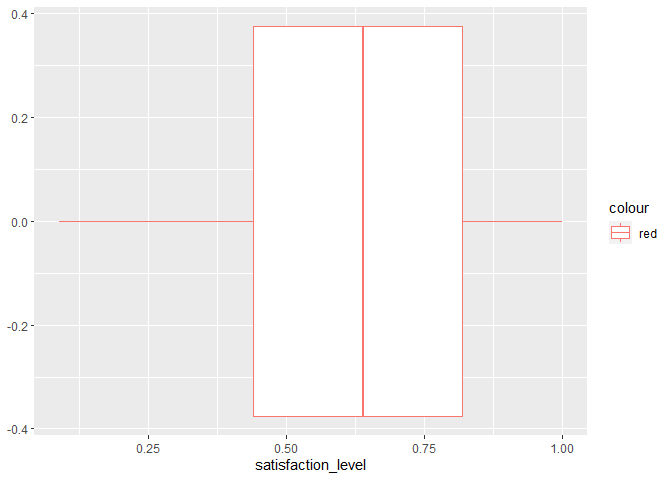
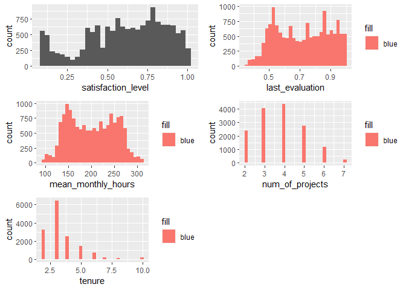
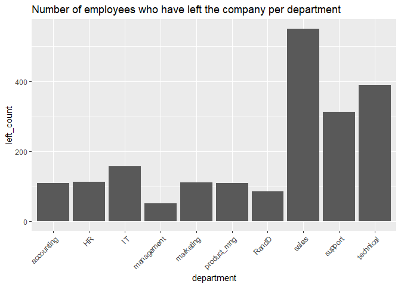
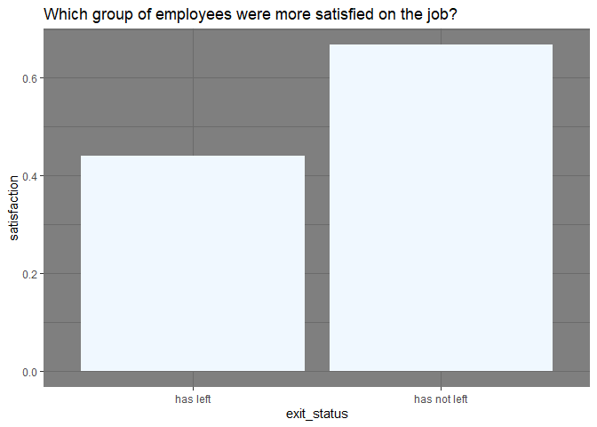
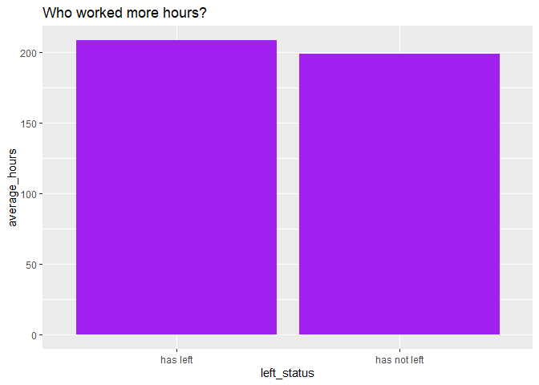
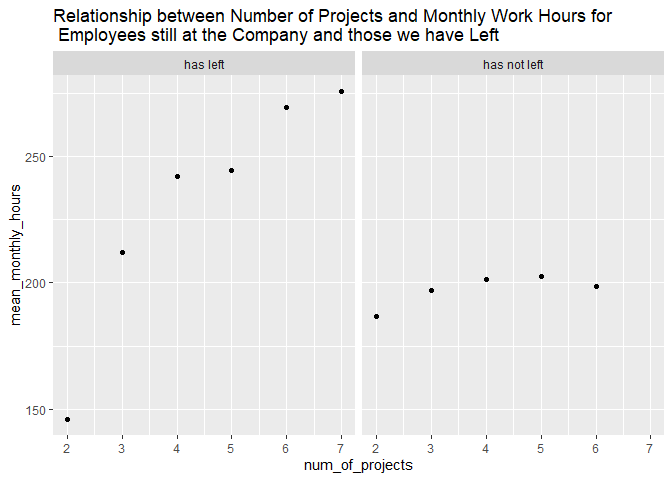

**How might Qeug Solutions prevent losing its employees??**
================

**Heads up:** *The names, content, and the narrative around the data
used in this work are fictional; a combined product of my imagination
and inspiration from the case study packet provided for Track 2 of the
capstone project course- course 8- of the [Google Data Analytics
Professional Certificate on
Coursera](https://www.coursera.org/professional-certificates/google-data-analytics?utm_source=gg&utm_medium=sem&utm_campaign=15-GoogleDataAnalytics-ROW&utm_content=B2C&campaignid=12566515400&adgroupid=117869292925&device=c&keyword=best%20courses%20for%20data%20analytics&matchtype=b&network=g&devicemodel=&adpostion=&creativeid=507290840618&hide_mobile_promo&gclid=CjwKCAjwt7SWBhAnEiwAx8ZLarCAB15nWLR97OdBdUrdZBVrolvnYzsLaXnXZnfbGHMTWsNnWC-SDxoCdJYQAvD_BwE).
Hence, the insights generated are not necessarily representative of
reality.*

*The data used is [a public employee profile dataset from
Kaggle](https://www.kaggle.com/datasets/jacksonchou/hr-data-for-analytics?select=HR_comma_sep.csv)
made available under the [CC0: Public
Domain](https://creativecommons.org/publicdomain/zero/1.0/) license.*

*My choice of this dataset and the project, entirely, is stirred by my
love for the **Human Resources** profession and how **People Analytics**
should be embraced to promote data-driven decision making in HR. I hope
you enjoy the ride through this work as much as I did creating it.*

### The Scenario

In this project, I worked as a junior People Analyst for a business
intelligence consultant, **Jotgel Analytics**. My organization
specializes in helping businesses make informed decisions across
different business functions using data and Business intelligence
technologies. Although I only joined the team 6 months ago, the People
Analytics unit Manager, Clara Michael, who is also my boss, believes I
am ready to take up bigger challenges and had asked me to lead a project
for a new client, **Qeug** **Solutions.**

***About Qeug Solutions***

Qeug Solutions; **Qeug**, for short, provides training and counseling
services to young immigrants looking to settle in a new country
anywhere, land a job early enough, and continue to get personal and
career guidance for, at least, a year into their first job.

Qeug is young, only in its first month of operation. However, the CEO
believes he is building a company that has come to stay, and part of his
objectives is to keep his employees for at least, 5 years, with the
company. He had shared this vision with the HR Director, Tracy Victor
upon her coming on board, with the later counseling that, as Qeug
renders a human-to-human-interaction-based service, it needs its best
hands on the job for as long as possible, especially as it wades through
its infancy stage. For example, a customer might have gotten used to an
employee in a counseling role and they may not be pleased starting all
over with a new employee. Qeug cannot afford to lose any of its
customers at this early stage too.

So, according to the HR director, Qeug needs to be intentional about
creating a good place to work for its employees so they can stick around
long enough to continue to help its clients navigate their way to
success and comfort in a new country. She believes that, to get on a
good path towards achieving this, the company can begin with using
external data to get a high-level view of likely reasons why employees
may leave, as a guide in sketching and implementing evolve-able
preventive policies early on. Alongside this, they can use the insights
generated to spot factors similar to Qeug’s employee profile while the
company accumulates more internal data towards its first end-of-year
analysis.

Tracy had these questions:

-   What is the turnover rate from the dataset being examined?

-   Which departments are the top 5 contributors to the overall number
    of terminates??

-   Why might an employee leave, and what characterises those who stay?

-   From the analysis done, what recommendations can guide Qeug in its
    quest to proactively keep its employees?

### Executing the project

Having Learnt about the Data Analytics process in the [Google Data
Analytics Certificate
Program](https://www.coursera.org/professional-certificates/google-data-analytics?utm_source=gg&utm_medium=sem&utm_campaign=15-GoogleDataAnalytics-ROW&utm_content=B2C&campaignid=12566515400&adgroupid=117869292925&device=c&keyword=best%20courses%20for%20data%20analytics&matchtype=b&network=g&devicemodel=&adpostion=&creativeid=507290840618&hide_mobile_promo&gclid=CjwKCAjwt7SWBhAnEiwAx8ZLarCAB15nWLR97OdBdUrdZBVrolvnYzsLaXnXZnfbGHMTWsNnWC-SDxoCdJYQAvD_BwE),
I have taken a liking to applying it in my projects as it helps for
**structured thinking**. While there are other variations of the
process, like the EMC data analytics life-cycle, the SAS data analytics
life-cycle, the big data analytics, etc., I used the Google Data
analytics process as my guide in this project. It consists of the
**Ask**-**Prepare**-**Process**-**Analyze**-**Share**-**Act** phases.

## **Ask:**

In this phase, I framed my statement of the business task and Identified
my Key stakeholders

#### Statement of the Business Task

To identify likely reasons for employee turnover in order to outline
guiding preventive measures.

#### Key Stakeholders

-   Qeug CEO

-   HR Director, Tracy Victor

## **Prepare:**

In this phase, I accessed the dataset for the project. The HR Director
has identified an [employee profile
dataset](https://www.kaggle.com/datasets/jacksonchou/hr-data-for-analytics?select=HR_comma_sep.csv)
from a hypothetical large company, made publicly available on Kaggle
under the [CC0: Public
Domain](https://creativecommons.org/publicdomain/zero/1.0/) license,
with the current sharer hinting that the original provider had deleted
their own submission. The data holds employee profile information, which
she would like me to use. While the data may not entirely represent
Qeug’s business context, she believes it can provide the generic view
they need on employee turnover.

I needed to get a closer look at my data so, I proceeded to set up my
environment. As you may have noticed, I used R for this project. You can
also use Python, spreadsheets, a combination of an SQL server and one of
the Bi tools like Tableau and PowerBi, among other options.

#### Setting up my environment

I installed required packages; the `tidyverse`, and `skimr`. I used the
`skimr` package because I wanted to explore the data set in depth before
answering the questions.

And, I loaded the packages.

``` r
#install.packages("tidyverse")
#install.packages("skimr")
#install.packages("ggplot2")
#install.packages("reshape2")
```

``` r
library(tidyverse)
```

    ## Warning: package 'tidyverse' was built under R version 4.2.2

    ## ── Attaching packages ─────────────────────────────────────── tidyverse 1.3.2 ──
    ## ✔ ggplot2 3.3.6      ✔ purrr   0.3.4 
    ## ✔ tibble  3.1.8      ✔ dplyr   1.0.10
    ## ✔ tidyr   1.2.0      ✔ stringr 1.4.1 
    ## ✔ readr   2.1.2      ✔ forcats 0.5.2

    ## Warning: package 'stringr' was built under R version 4.2.2

    ## ── Conflicts ────────────────────────────────────────── tidyverse_conflicts() ──
    ## ✖ dplyr::filter() masks stats::filter()
    ## ✖ dplyr::lag()    masks stats::lag()

``` r
library(skimr)
```

    ## Warning: package 'skimr' was built under R version 4.2.2

``` r
library(ggplot2)
library(reshape2)
```

    ## 
    ## Attaching package: 'reshape2'
    ## 
    ## The following object is masked from 'package:tidyr':
    ## 
    ##     smiths

I then moved on to load the data set.

``` r
employee_profile_data <- read_csv("C:/Users/Paulina/Git_files/my_Git_repos/HRAnalyticsProject/employee_profile_data.csv")
```

    ## Rows: 14999 Columns: 10
    ## ── Column specification ────────────────────────────────────────────────────────
    ## Delimiter: ","
    ## chr (2): sales, salary
    ## dbl (8): satisfaction_level, last_evaluation, number_project, average_montly...
    ## 
    ## ℹ Use `spec()` to retrieve the full column specification for this data.
    ## ℹ Specify the column types or set `show_col_types = FALSE` to quiet this message.

#### Getting to know the data

Next, I used functions like `head()`, `str()`, `glimpse()`,
`colnames()`, and `skim_without_charts()` to get a summarized
description of the data.

With the `head()` function, I get to see the first 6 rows and all
columns of the data set. However, what is more interesting, for me, is
getting a peek into the data types and column names.

``` r
head(employee_profile_data)
```

    ## # A tibble: 6 × 10
    ##   satisfact…¹ last_…² numbe…³ avera…⁴ time_…⁵ Work_…⁶  left promo…⁷ sales salary
    ##         <dbl>   <dbl>   <dbl>   <dbl>   <dbl>   <dbl> <dbl>   <dbl> <chr> <chr> 
    ## 1        0.38    0.53       2     157       3       0     1       0 sales low   
    ## 2        0.8     0.86       5     262       6       0     1       0 sales medium
    ## 3        0.11    0.88       7     272       4       0     1       0 sales medium
    ## 4        0.72    0.87       5     223       5       0     1       0 sales low   
    ## 5        0.37    0.52       2     159       3       0     1       0 sales low   
    ## 6        0.41    0.5        2     153       3       0     1       0 sales low   
    ## # … with abbreviated variable names ¹​satisfaction_level, ²​last_evaluation,
    ## #   ³​number_project, ⁴​average_montly_hours, ⁵​time_spend_company,
    ## #   ⁶​Work_accident, ⁷​promotion_last_5years

The `str()` and `glimpse()` functions help me better understand the
data.

``` r
str(employee_profile_data)
```

    ## spec_tbl_df [14,999 × 10] (S3: spec_tbl_df/tbl_df/tbl/data.frame)
    ##  $ satisfaction_level   : num [1:14999] 0.38 0.8 0.11 0.72 0.37 0.41 0.1 0.92 0.89 0.42 ...
    ##  $ last_evaluation      : num [1:14999] 0.53 0.86 0.88 0.87 0.52 0.5 0.77 0.85 1 0.53 ...
    ##  $ number_project       : num [1:14999] 2 5 7 5 2 2 6 5 5 2 ...
    ##  $ average_montly_hours : num [1:14999] 157 262 272 223 159 153 247 259 224 142 ...
    ##  $ time_spend_company   : num [1:14999] 3 6 4 5 3 3 4 5 5 3 ...
    ##  $ Work_accident        : num [1:14999] 0 0 0 0 0 0 0 0 0 0 ...
    ##  $ left                 : num [1:14999] 1 1 1 1 1 1 1 1 1 1 ...
    ##  $ promotion_last_5years: num [1:14999] 0 0 0 0 0 0 0 0 0 0 ...
    ##  $ sales                : chr [1:14999] "sales" "sales" "sales" "sales" ...
    ##  $ salary               : chr [1:14999] "low" "medium" "medium" "low" ...
    ##  - attr(*, "spec")=
    ##   .. cols(
    ##   ..   satisfaction_level = col_double(),
    ##   ..   last_evaluation = col_double(),
    ##   ..   number_project = col_double(),
    ##   ..   average_montly_hours = col_double(),
    ##   ..   time_spend_company = col_double(),
    ##   ..   Work_accident = col_double(),
    ##   ..   left = col_double(),
    ##   ..   promotion_last_5years = col_double(),
    ##   ..   sales = col_character(),
    ##   ..   salary = col_character()
    ##   .. )
    ##  - attr(*, "problems")=<externalptr>

``` r
glimpse(employee_profile_data)
```

    ## Rows: 14,999
    ## Columns: 10
    ## $ satisfaction_level    <dbl> 0.38, 0.80, 0.11, 0.72, 0.37, 0.41, 0.10, 0.92, …
    ## $ last_evaluation       <dbl> 0.53, 0.86, 0.88, 0.87, 0.52, 0.50, 0.77, 0.85, …
    ## $ number_project        <dbl> 2, 5, 7, 5, 2, 2, 6, 5, 5, 2, 2, 6, 4, 2, 2, 2, …
    ## $ average_montly_hours  <dbl> 157, 262, 272, 223, 159, 153, 247, 259, 224, 142…
    ## $ time_spend_company    <dbl> 3, 6, 4, 5, 3, 3, 4, 5, 5, 3, 3, 4, 5, 3, 3, 3, …
    ## $ Work_accident         <dbl> 0, 0, 0, 0, 0, 0, 0, 0, 0, 0, 0, 0, 0, 0, 0, 0, …
    ## $ left                  <dbl> 1, 1, 1, 1, 1, 1, 1, 1, 1, 1, 1, 1, 1, 1, 1, 1, …
    ## $ promotion_last_5years <dbl> 0, 0, 0, 0, 0, 0, 0, 0, 0, 0, 0, 0, 0, 0, 0, 0, …
    ## $ sales                 <chr> "sales", "sales", "sales", "sales", "sales", "sa…
    ## $ salary                <chr> "low", "medium", "medium", "low", "low", "low", …

With the `skim_without_charts()` function, I got summary statistics of
the data.

``` r
skim_without_charts(employee_profile_data)
```

|                                                  |                       |
|:-------------------------------------------------|:----------------------|
| Name                                             | employee_profile_data |
| Number of rows                                   | 14999                 |
| Number of columns                                | 10                    |
| \_\_\_\_\_\_\_\_\_\_\_\_\_\_\_\_\_\_\_\_\_\_\_   |                       |
| Column type frequency:                           |                       |
| character                                        | 2                     |
| numeric                                          | 8                     |
| \_\_\_\_\_\_\_\_\_\_\_\_\_\_\_\_\_\_\_\_\_\_\_\_ |                       |
| Group variables                                  | None                  |

Data summary

**Variable type: character**

| skim_variable | n_missing | complete_rate | min | max | empty | n_unique | whitespace |
|:--------------|----------:|--------------:|----:|----:|------:|---------:|-----------:|
| sales         |         0 |             1 |   2 |  11 |     0 |       10 |          0 |
| salary        |         0 |             1 |   3 |   6 |     0 |        3 |          0 |

**Variable type: numeric**

| skim_variable         | n_missing | complete_rate |   mean |    sd |    p0 |    p25 |    p50 |    p75 | p100 |
|:----------------------|----------:|--------------:|-------:|------:|------:|-------:|-------:|-------:|-----:|
| satisfaction_level    |         0 |             1 |   0.61 |  0.25 |  0.09 |   0.44 |   0.64 |   0.82 |    1 |
| last_evaluation       |         0 |             1 |   0.72 |  0.17 |  0.36 |   0.56 |   0.72 |   0.87 |    1 |
| number_project        |         0 |             1 |   3.80 |  1.23 |  2.00 |   3.00 |   4.00 |   5.00 |    7 |
| average_montly_hours  |         0 |             1 | 201.05 | 49.94 | 96.00 | 156.00 | 200.00 | 245.00 |  310 |
| time_spend_company    |         0 |             1 |   3.50 |  1.46 |  2.00 |   3.00 |   3.00 |   4.00 |   10 |
| Work_accident         |         0 |             1 |   0.14 |  0.35 |  0.00 |   0.00 |   0.00 |   0.00 |    1 |
| left                  |         0 |             1 |   0.24 |  0.43 |  0.00 |   0.00 |   0.00 |   0.00 |    1 |
| promotion_last_5years |         0 |             1 |   0.02 |  0.14 |  0.00 |   0.00 |   0.00 |   0.00 |    1 |

The `colnames()` function provides me a list of the names of the columns
in the data set.

``` r
colnames(employee_profile_data)
```

    ##  [1] "satisfaction_level"    "last_evaluation"       "number_project"       
    ##  [4] "average_montly_hours"  "time_spend_company"    "Work_accident"        
    ##  [7] "left"                  "promotion_last_5years" "sales"                
    ## [10] "salary"

The dataset provides information like satisfaction level, results
obtained from last evaluation, number of projects an employee was
involved in for the year, how long the employee has been in the
organization, if they have been involved in any accident at work, if
they are still with the organization or have left, etc. Each row is a
record representing an employee.

From the above, the dataset has 14,999 rows and 10 columns. While 8 of
the columns appear to hold numeric data, with only two containing text
(categorical) data, a closer look reveals that the
`promotion_last_5years` and `left` columns actually hold numeric
representations of Boolean data in which, 0 indicates ‘False’ and 1
indicates ‘True’. So, a value of 0 in the `left` column means that an
employee is still with the company while 1 means that the employee has
left the company. The same goes for the `promotion_5years` column. 0
means that an employee has not been promoted in the last 5 years and 1
means they have been promoted. So, we can, as well, say that these two
columns contain categorical data but, encoding them with numbers helps
us to examine their relationship with columns holding numeric data

The `time_spend_company` column could be made shorter and more
descriptive. The name, `sales`, is inappropriate for the information
contained in the column it represents. The column shows the department
an employee belongs to, rather than sales details.

## Process

In this phase, I cleaned and transformed my data in preparation for
analysis.

Recall that, in the prepare phase, some data transformation needs had
already been identified. So, in this phase, I examined the data further
to detect dirty data issues, and fix them.

Because I do not like to assume data cleaning issues as that may lead to
missing out on those I do not remember or have never encountered, I
prefer to conceptualize techniques that will search through the data to
fish them out. So, I coined a sequential process to use in combination
with the usual dirty data scenarios most Data Analysts face, like the
duplicate records, missing values, incorrect or misspelled values,
outliers, etc. I call my process the **Detect**-**Expose**-**Fix**
Model. This model helps me avoid trying to treat a dirty data issue that
doesn’t exist and helps me focus on those that exist.

In some cases, all of these three steps can be achieved in one syntax,
query or code. In some,two of the steps gets tackled at a go. When
otherwise, each step is executed in turn. Let’s begin!

#### Dealing with Duplicates

I began by checking if there are duplicate rows in the dataset.

``` r
employee_profile_data %>%
  duplicated() %>%
  sum()
```

    ## [1] 3008

There are 3008 duplicate rows in the dataset. I proceeded to remove
them. I did this by collecting all unique rows into a new dataframe.

``` r
employee_profile_unique <- unique(employee_profile_data)
```

Duplicate rows removed!

#### Addressing Missing Values

``` r
employee_profile_unique %>%        # sum(is.na(employee_profile_data))- also works.
  is.na %>%                      # I just like to pipe to keep my code neat
  sum
```

    ## [1] 0

There are no missing values in this dataset.

#### Renaming columns

The `time_spend_company` column is better if shorter. I renamed it as
`tenure`. The name, “sales”, is incorrect for the information contained
in the column it represents. Instead, the entries in the column show the
`department` each employee works in. I also renamed the
`promotion_last_5years`, `number_project columns`, etc. The goal here
was to make each column more representative and descriptive.

``` r
employee_profile_renamed <- 
employee_profile_unique %>%
  rename(tenure = time_spend_company, department = sales, promoted_last_5years = promotion_last_5years, num_of_projects = number_project, mean_monthly_hours = average_montly_hours)
```

To confirm this change, I called the `colnames()` function again

``` r
colnames(employee_profile_renamed)
```

    ##  [1] "satisfaction_level"   "last_evaluation"      "num_of_projects"     
    ##  [4] "mean_monthly_hours"   "tenure"               "Work_accident"       
    ##  [7] "left"                 "promoted_last_5years" "department"          
    ## [10] "salary"

Changes were effected!

**Checking for, and addressing string data inconsistency**

My focus here is on the two columns with categorical (text) data;
`department` and `salary` columns. Following my **Detect-Expose-Fix**
model, first, I want to get distinct values in these columns. This will
help bring incorrectly entered, mis-spelled or inconsistently formated
values to the fore, if any.

``` r
# Checking the department column

employee_profile_renamed %>%
  distinct(department)
```

    ## # A tibble: 10 × 1
    ##    department 
    ##    <chr>      
    ##  1 sales      
    ##  2 accounting 
    ##  3 hr         
    ##  4 technical  
    ##  5 support    
    ##  6 management 
    ##  7 IT         
    ##  8 product_mng
    ##  9 marketing  
    ## 10 RandD

In the \`department\` column, I wanted ‘hr’ to appear in uppercase
format, like ‘IT’ , considering they are both acronyms. Note that
‘RandD’ means ‘Research and Development’.

``` r
employee_profile_renamed <- employee_profile_renamed %>%                          
  mutate(department = replace(department, department == "hr", "HR")) # 'mutate', because I want the change to happen inplace.

# Checking that the change has been effected
employee_profile_renamed %>%
  filter(department == "HR") %>%
  head()
```

    ## # A tibble: 6 × 10
    ##   satisfac…¹ last_…² num_o…³ mean_…⁴ tenure Work_…⁵  left promo…⁶ depar…⁷ salary
    ##        <dbl>   <dbl>   <dbl>   <dbl>  <dbl>   <dbl> <dbl>   <dbl> <chr>   <chr> 
    ## 1       0.45    0.57       2     134      3       0     1       0 HR      low   
    ## 2       0.4     0.51       2     145      3       0     1       0 HR      low   
    ## 3       0.45    0.55       2     140      3       0     1       0 HR      low   
    ## 4       0.84    0.87       4     246      6       0     1       0 HR      low   
    ## 5       0.71    0.87       3     177      4       0     1       0 HR      medium
    ## 6       0.4     0.49       2     155      3       0     1       0 HR      medium
    ## # … with abbreviated variable names ¹​satisfaction_level, ²​last_evaluation,
    ## #   ³​num_of_projects, ⁴​mean_monthly_hours, ⁵​Work_accident,
    ## #   ⁶​promoted_last_5years, ⁷​department

Change effected!

Next, I checked for text data inconsistency in the `salary` column.

``` r
employee_profile_renamed %>%
  distinct(salary)
```

    ## # A tibble: 3 × 1
    ##   salary
    ##   <chr> 
    ## 1 low   
    ## 2 medium
    ## 3 high

There are no textual inconsistencies in this column.

#### Dealing with Outliers

Here, I used boxplots to check the distribution of all columns with
numeric values. The boxplots will also reveal columns that have
outliers.

``` r
hr_hist <- employee_profile_renamed %>%
  par(mfrow=c(2,3))
```

    ## Warning in par(., mfrow = c(2, 3)): argument 1 does not name a graphical
    ## parameter

``` r
boxplot(employee_profile_renamed$satisfaction_level,col="#3090C7", main = "Satisfaction level") 
boxplot(employee_profile_renamed$last_evaluation,col="#3090C7", main = "Last evaluation")
boxplot(employee_profile_renamed$mean_monthly_hours,col="#3090C7", main = "Average_monthly_hours")
boxplot(employee_profile_renamed$num_of_projects,col="#3090C7", main = "Number_of_projects") 
boxplot(employee_profile_renamed$tenure,col="#3090C7", main = "Tenure")
```

<!-- -->

From the boxplots above, we see that there are outliers in the `tenure`
column. How do we treat this?

The context of the data needs to be considered in deciding what to do
with outliers. The column of focus here holds details of how long an
employee has worked at the company. It is not out of place for some
employees to have worked for more years than the average time spent at
the company so, the outliers here may not indicate incorrect or
out-of-range data. Based on this, we keep the data as is, and we report
the average for that column with the median, from the
five-number-summary concept, rather than the mean.

As we move on from this stage, we can conclude that:

-   Our clean dataset now has 11,991 rows and 10 columns.

-   With 11,991 records, the dataset is enough for this analysis. The
    essence of the project is to look at historical data that is also
    external to the company, **Qeug**, so the data is also appropriate
    for the task. Furthermore, it has been stripped of all personally
    Identifiable information (PII) like employee names, email address,
    residential address, phone number, etc., and it is cited.

Safe to say our Data ROCCS!

## Analyse

In this stage, I proceeded to answer Tracy’s questions.

Now that our dataset is clean, I began by looking at summary statistics
again.

``` r
skim_without_charts(employee_profile_renamed)
```

|                                                  |                          |
|:-------------------------------------------------|:-------------------------|
| Name                                             | employee_profile_renamed |
| Number of rows                                   | 11991                    |
| Number of columns                                | 10                       |
| \_\_\_\_\_\_\_\_\_\_\_\_\_\_\_\_\_\_\_\_\_\_\_   |                          |
| Column type frequency:                           |                          |
| character                                        | 2                        |
| numeric                                          | 8                        |
| \_\_\_\_\_\_\_\_\_\_\_\_\_\_\_\_\_\_\_\_\_\_\_\_ |                          |
| Group variables                                  | None                     |

Data summary

**Variable type: character**

| skim_variable | n_missing | complete_rate | min | max | empty | n_unique | whitespace |
|:--------------|----------:|--------------:|----:|----:|------:|---------:|-----------:|
| department    |         0 |             1 |   2 |  11 |     0 |       10 |          0 |
| salary        |         0 |             1 |   3 |   6 |     0 |        3 |          0 |

**Variable type: numeric**

| skim_variable        | n_missing | complete_rate |   mean |    sd |    p0 |    p25 |    p50 |    p75 | p100 |
|:---------------------|----------:|--------------:|-------:|------:|------:|-------:|-------:|-------:|-----:|
| satisfaction_level   |         0 |             1 |   0.63 |  0.24 |  0.09 |   0.48 |   0.66 |   0.82 |    1 |
| last_evaluation      |         0 |             1 |   0.72 |  0.17 |  0.36 |   0.57 |   0.72 |   0.86 |    1 |
| num_of_projects      |         0 |             1 |   3.80 |  1.16 |  2.00 |   3.00 |   4.00 |   5.00 |    7 |
| mean_monthly_hours   |         0 |             1 | 200.47 | 48.73 | 96.00 | 157.00 | 200.00 | 243.00 |  310 |
| tenure               |         0 |             1 |   3.36 |  1.33 |  2.00 |   3.00 |   3.00 |   4.00 |   10 |
| Work_accident        |         0 |             1 |   0.15 |  0.36 |  0.00 |   0.00 |   0.00 |   0.00 |    1 |
| left                 |         0 |             1 |   0.17 |  0.37 |  0.00 |   0.00 |   0.00 |   0.00 |    1 |
| promoted_last_5years |         0 |             1 |   0.02 |  0.13 |  0.00 |   0.00 |   0.00 |   0.00 |    1 |

Comparing the summary statistics we got before we removed duplicates, we
see that, for example, the average satisfaction level moved from 0.61 to
0.63 and its 3rd quantile dropped from 0.87 to 0.86. The average for
mean_monthly_hours moved from 201 to 200 while its standard deviation
moved from 49.94 to 48.73 and its first quantile moved from 156 to 157.
The average time spent at the company moved from 3.50 to 3.36 with its
standard deviation moving from 1.46 to 1.33.

This points us to the importance of removing duplicates from our
dataset. It improves the integrity of our data.

A number of highlights from this summary:

-   Satisfaction level at this company is 0.62 on average, out of a
    possible 1.0.

-   Also, in the last evaluation exercise, employees scored above 0.7 on
    average, out of a possible 1.0. Appears good enough.

-   On average, an employee is involved in 4 projects (I am reporting
    with the median- p50- here because the column contains discrete
    values).

-   In a month, an employee works for about 200 hours on average.

-   Employees spend at least, 2 years at the company and 3 years on
    average However, there are a few employees who have stuck with the
    company for as many as 10 years.

Looking at Tracy’s question

#### 1. What is the turnover rate from the dataset being examined?

According to the
[AIHR](https://www.aihr.com/blog/how-to-calculate-employee-turnover-rate/),

1.  Turnover rate = (number of terminates during period/number of
    employees at beginning of period)

    This formula does not consider new hires as employees. The
    [AIHR](https://www.aihr.com/blog/how-to-calculate-employee-turnover-rate/)
    has a strong argument in favor of excluding new hires when
    calculating employee turnover. Also, the dataset does not provide
    any information about new employees joining at any point. Infact,
    the least time spent at the company is 2 years. So, the above
    formula was appropriate.

    Note: There are other formulas =, like the ANSI proposed formula
    that includes new hires as employees, as shown in this
    [CFI](https://corporatefinanceinstitute.com/resources/management/employee-turnover-rate/)
    article.

``` r
# no of employees who left
left_num <- employee_profile_renamed %>%
  filter(left == 1) %>%
  summarise(left_prop=n())

# total number of employees
total_num = nrow(employee_profile_renamed)

turnover_rate = round(((left_num/total_num) * 100), 2)
print(turnover_rate)
```

    ##   left_prop
    ## 1      16.6

The turnover rate is 16.6% . This means that 16.6% of the employees have
left the company.

In addition, I visualized the proportion of the company’s employees who
have left.

``` r
emp_prop <- employee_profile_renamed %>%
  group_by(exit_status = as.factor(recode(left, '0' = 'has not left', '1' = 'has left'))) %>%
  summarise(count_left = n()) %>%
  arrange(desc(count_left))

ggplot(emp_prop, aes(x = "", y = count_left, fill = exit_status)) +
  geom_col() + 
  labs(title= "Proportion of employees who have left and those still at the company") +
  coord_polar(theta = "y") +   # there is no pie_chart function in ggplot2, hence the coord_polar feature is needed to help us curve a bar or column chart into a pie
  theme_void()
```

<!-- -->

#### 2. Which departments are the top 5 contributors to the overall number of terminates?

To answer this question, first, I wanted to see the total number of
employees for each department…

``` r
dept_emp_count <- employee_profile_renamed %>%
  group_by(department) %>%
  summarise(dept_count = n()) %>%
  arrange(desc(dept_count))

print(dept_emp_count)
```

    ## # A tibble: 10 × 2
    ##    department  dept_count
    ##    <chr>            <int>
    ##  1 sales             3239
    ##  2 technical         2244
    ##  3 support           1821
    ##  4 IT                 976
    ##  5 RandD              694
    ##  6 product_mng        686
    ##  7 marketing          673
    ##  8 accounting         621
    ##  9 HR                 601
    ## 10 management         436

…then I looked at the number of employees who left, by department.

``` r
left_emp_count <- employee_profile_renamed %>%
  filter(left == 1) %>%
  group_by(department) %>%
  summarize(left_count = n()) %>%
   arrange(desc(left_count))

print(left_emp_count)
```

    ## # A tibble: 10 × 2
    ##    department  left_count
    ##    <chr>            <int>
    ##  1 sales              550
    ##  2 technical          390
    ##  3 support            312
    ##  4 IT                 158
    ##  5 HR                 113
    ##  6 marketing          112
    ##  7 product_mng        110
    ##  8 accounting         109
    ##  9 RandD               85
    ## 10 management          52

``` r
ggplot(left_emp_count, aes(x = department, y = left_count)) + 
  geom_bar(stat = 'identity') +
  labs(title="Number of employees who have left the company per department") + 
  theme(axis.text.x.bottom = element_text(angle = 45, hjust = 1))
```

<!-- -->

The Sales, Technical, Support, IT and HR are the top 5 departments
contributing the most to the total number of terminates.

**PS**: Note, however, that this does not translate to them being the
worst hit by the turnover. Should Queg Solutions need to examine
turnover when it has accumulated enough internal data, and wishes to
find out which of their departments is worst hit, It would be better to
look at what percentage or proportion of the total number of employees
in each department, have left, rather than a count.

To explain this; looking at the two tables again, the top four
departments maintain status quo as the departments with the highest
number of employees in total, and, the departments with the highest
number of employees who have left. The management department also
maintains status quo as the department with the least number of
employees in total, and that has lost the least number of employees.

But, looking at the remaining 5 departments, some insights catch the
eye. The HR department, for example, which is second to bottom in terms
of total number of employees, has lost enough employees to take it to
fifth spot on the list of terminates per department. So, while it
appears the sales department may have lost the most numbers of
employees, we cannot say that it is the worst hit, considering it has
the most employees too.

To show this, I merged the two dataframes; `dept_emp_count` and
`left_emp_count` to form a new one; `dept_left_percent`, then i added a
new column that calculates the percentages. This was possible because
both dataframes had a common column; `department`

``` r
dept_left_percent = 
  merge(x = dept_emp_count, y = left_emp_count, by = "department") %>%
  mutate(left_percent = (left_count/dept_count) * 100) %>%
  arrange(desc(left_percent))

print(dept_left_percent)
```

    ##     department dept_count left_count left_percent
    ## 1           HR        601        113     18.80200
    ## 2   accounting        621        109     17.55233
    ## 3    technical       2244        390     17.37968
    ## 4      support       1821        312     17.13344
    ## 5        sales       3239        550     16.98055
    ## 6    marketing        673        112     16.64190
    ## 7           IT        976        158     16.18852
    ## 8  product_mng        686        110     16.03499
    ## 9        RandD        694         85     12.24784
    ## 10  management        436         52     11.92661

``` r
#as.data.frame((left_emp_count$left_count/dept_emp_count$dept_count) * 100)
```

Interesting! Turns out the the department responsible for retaining
employees; the HR department, was the worst hit by the turnover here,
followed by the Accounting department. As implied earlier, while this
insight may not mean much to Queg Solutions for this project, It’s one
the company may want to pay attention to when it begins analyzing its
own data.

#### 3. Why might an employee leave, and what characterises those who stay.

I put two questions in one here in order to consider the conditions that
made terminates leave alongside a corresponding look at what the
environment might have been for those still at the company.

I began answering this question by looking at the relationships between
variables in the dataset. The relationship between salary and other
variables is an interesting one I wanted to see but, the salary column
was in character type. We can only compare relationships between numeric
variables.

So, I converted this column to numeric by assigning numbers
incrementally to each category of values represented in the column.

``` r
employee_profile_recoded <- employee_profile_renamed %>%
  mutate(salary = as.numeric(recode(salary, low = '1', 'medium' = '2', 'high' = '3')))

head(employee_profile_recoded)
```

    ## # A tibble: 6 × 10
    ##   satisfac…¹ last_…² num_o…³ mean_…⁴ tenure Work_…⁵  left promo…⁶ depar…⁷ salary
    ##        <dbl>   <dbl>   <dbl>   <dbl>  <dbl>   <dbl> <dbl>   <dbl> <chr>    <dbl>
    ## 1       0.38    0.53       2     157      3       0     1       0 sales        1
    ## 2       0.8     0.86       5     262      6       0     1       0 sales        2
    ## 3       0.11    0.88       7     272      4       0     1       0 sales        2
    ## 4       0.72    0.87       5     223      5       0     1       0 sales        1
    ## 5       0.37    0.52       2     159      3       0     1       0 sales        1
    ## 6       0.41    0.5        2     153      3       0     1       0 sales        1
    ## # … with abbreviated variable names ¹​satisfaction_level, ²​last_evaluation,
    ## #   ³​num_of_projects, ⁴​mean_monthly_hours, ⁵​Work_accident,
    ## #   ⁶​promoted_last_5years, ⁷​department

Then I checked the nature of relationship between columns using a
heatmap. Note that to create a heatmap in ggplot2, you need long data,
as opposed to wide data format. This is where the `melt` function from
the `reshape` package comes in.

``` r
cor <- melt(cor(employee_profile_recoded[sapply(employee_profile_recoded,is.numeric)]))

ggplot(cor, aes(x = Var1, y = Var2)) + 
  geom_tile(aes(fill = value)) + 
  scale_fill_gradient(low = "yellow", high = "black") +
  theme(axis.text.x.bottom = element_text(angle = 45, hjust = 1)) +
  geom_text(aes(label = round(value, 1)))
```

<!-- -->

It appears not much is happening here. Between most of the variables,
there is either no correlation or the relationship is weak; weak
positive or weak negative.

However, an insight to see here is how salary shows little to no
correlation with any of the other variables. This could mean that
working more hours, taking up more projects, pulling a high score in the
most recent evaluation exercise, or remaining with the company for
longer, may not necessarily attract a raise or a higher salary.

Could this be an indication that time commitment, or length of service,
for example, is not rewarded at this company? or maybe the reward for
any of these is not a raise?

Remember, correlation does not always imply causation.

Moving on, I wanted to see through the fields in the dataset, what
characterised a terminate’s time at the company, compared to that of an
employee who is still at the company

**Were terminates satisfied?**

From our summary statistics, the average satisfaction level is 0.62.
While this looks moderate, is this so, or close to so, across board?

``` r
satisfaction_df <- employee_profile_renamed %>% 
  group_by(exit_status = as.factor(recode(left, '0' = 'has not left', '1' = 'has left'))) %>%
  summarise(satisfaction = mean(satisfaction_level))

satisfaction_df
```

    ## # A tibble: 2 × 2
    ##   exit_status  satisfaction
    ##   <fct>               <dbl>
    ## 1 has left            0.440
    ## 2 has not left        0.667

``` r
ggplot(satisfaction_df, aes(x = exit_status, y = satisfaction)) + 
  geom_bar(stat = 'identity', fill = 'purple') +
  labs(title="Which group of employees were more satisfied on the job?")
```

<!-- -->

-   We can see that, satisfaction level for a terminate was below
    average while an employee still at the company exceeded it.

I went ahead to look at what proportion of the terminates and retainees
reached or surpassed the average satisfaction level.

Note: I did not use count or, say, proportion of entire employees
because the number of retainees far outweighs terminates. There are over
5 times more retainees than terminates, so using any of these statistics
would not provide a fair and accurate comparison. Also note that the
figures below will not yield a total percentage of 100% as they do not
share the same denominator.

``` r
satisfaction_count = employee_profile_renamed %>%
  filter(satisfaction_level >= 0.62) %>%
  group_by(left) %>%
  summarise(number = n())

sat_prop_not_left <- round(((satisfaction_count$number[1]/emp_prop$count_left[1]) * 100), 2)  # R counts from 1, not 0
# remember emp_prop from the pie chart code chunk

sat_prop_left <- round(((satisfaction_count$number[2]/emp_prop$count_left[2]) * 100), 2)

sat_prop_not_left
```

    ## [1] 62.19

``` r
sat_prop_left
```

    ## [1] 27.42

We see here that while about 60% of those still at the company are
satisfied on the job, only about 27% of those who left were satisfied.

I wanted to see if this was so across departments.

First, I wanted to see satisfaction level of terminates and those still
at the company, b department and, then, look at how many employees in
each department crossed the 0.62 average.

**How long, hourly, were employees working?**

``` r
hours <- employee_profile_renamed %>% 
  group_by(exit_status = as.factor(recode(left, '0' = 'has not left', '1' = 'has left'))) %>%
  summarise(average_hours = mean(mean_monthly_hours))

hours
```

    ## # A tibble: 2 × 2
    ##   exit_status  average_hours
    ##   <fct>                <dbl>
    ## 1 has left              208.
    ## 2 has not left          199.

``` r
ggplot(hours, aes(x = exit_status, y = average_hours)) + 
  geom_bar(stat = 'identity', fill = 'aquamarine') +
  labs(title="Who worked more hours?") +
  theme_dark()
```

<!-- -->

Looks like, on average, those employees who left work slightly more
hours than their counterparts who are still at the company.

``` r
ggplot(employee_profile_renamed, aes(x = mean_monthly_hours)) +
  geom_histogram(fill = 'pink') +
  facet_wrap(~as.factor(recode(left, '0' = 'has not left', '1' = 'has left'))) +
  theme(axis.text.x = element_text(angle = 45)) +
  labs(title="Distribution of monthly work hours of employees who remained at the \n company and those who left") +
  theme_dark()
```

    ## `stat_bin()` using `bins = 30`. Pick better value with `binwidth`.

<!-- -->

The focus here is not the height of the bins, but the spread. Why?
Remember that there are way more people still at the company than those
who have left, so it is expected to have taller and fuller bins in a
distribution of records for those employees still at the company,
compared to those who have left.

So, the insight here is in the spread. The summary statistics I looked
at earlier, after the process stage, had hinted that some employees work
for as long as 310 hours in a month. This histogram reveals that nealy,
if not all of those employees who work for that long, are part of those
who have left, and no employee who is still at the company work for to
300 hours.

Correspondingly, while there are retained employees who worked for less
than 100 hours in a month, none of the employees who left had that
leisure. The least mean_monthly_hours for terminates in a month was
above 100 hours. Could it be that those who left did because they were
confined to a a certain length of work hours, longer than that of those
still at the company?

Combined with insights from the bar chart, there are indications that
working for longer hours, when compared to employees still at the
company, may have contributed to these employees leaving.

I wanted to see how
